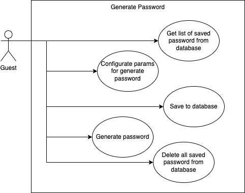

# Generate-Password

## Description in Polish language
Aplikacja jest stworzona dla generowania hasła które da się zapisać do bazy danych, odczytać ich z tam tą i usunąć.
Aplikacja została zbudowana za pomocą NestJS "framework" oparta w języku oprogramowania TypeScript.
W projekcie zostało zbudowano trzy tak zwane "endpoint" dla tego żeby:
1. Pobrać wszystkie zapisany hasło z bazy danych.
2. Zapisać generowane hasło do bazy danych.
3. Usunąć wszystkie zapisywane hasła z bazy danych.

W jakości bazy danych zostało wybrane MongoDB. Zostały zbudowane odpowiednie modele przez które łatwo się posługuje się w procesie związanym z komunikacją pomiędzy MongoDB a NestJS/backend.

Dla zachowania wersionowania obrazów zostało użyty Docker który pozwala budować obrazy z kodem dla produkcji oraz zostało udostępnione publiczne obrazy po przed Docker Hub.

Poniżej w pliku jest zaprezentowana diagram UML i opis jak uruchomić projekt.

## Diagram: UML


## Docker

### Main way

#### Run from docker-compose.yml
```bash
$ docker-compose up -d -V --build 
```

### Alternative way

#### Download
```bash
$ docker pull karba/generate-password:latest
```

### Run container
```bash
$ docker run -it -p 3000:3000 karba/generate-password
```

## App
### Installation

```bash
$ npm install
```

### Running the app

```bash
# development
$ npm run start

# watch mode
$ npm run start:dev

# production mode
$ npm run start:prod
```

## Test

```bash
# unit tests
$ npm run test

# e2e tests
$ npm run test:e2e

# test coverage
$ npm run test:cov
```
